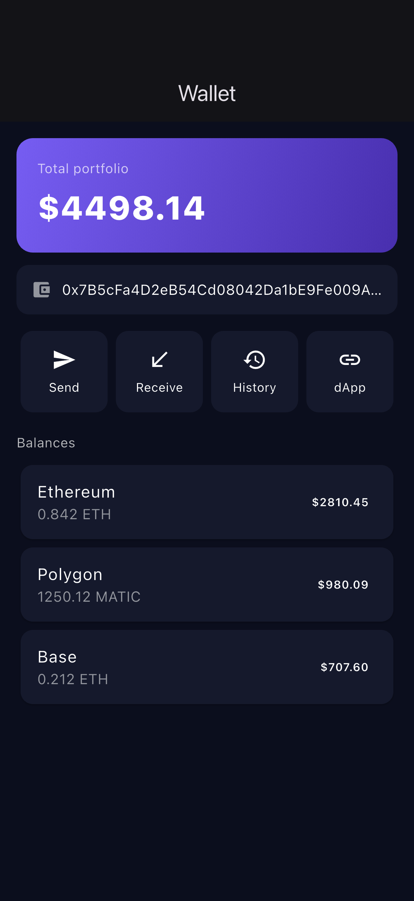
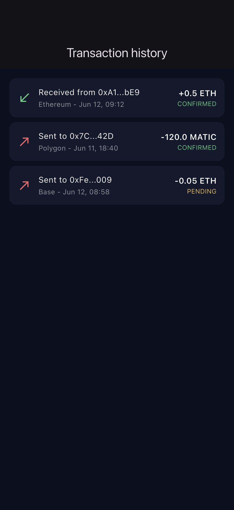
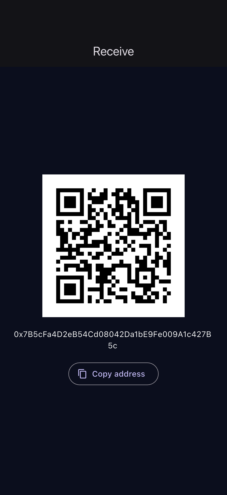
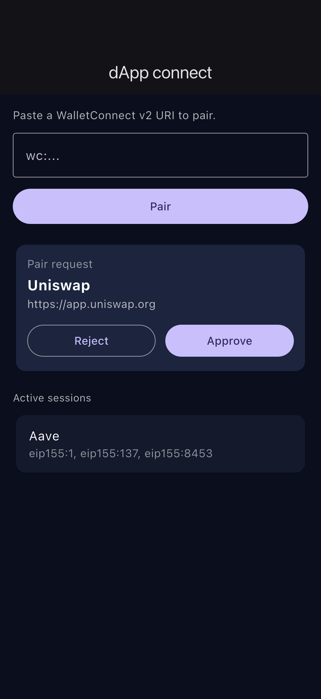
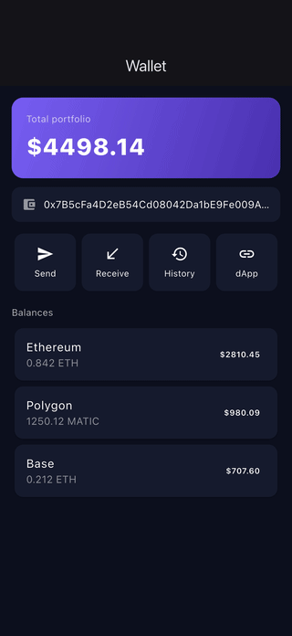

# flutter-crypto-wallet

Flutter POC for a multi-chain crypto wallet.

## Demo

Real iOS-Simulator captures from the running app (no mockups). See [FLOW.md](FLOW.md) for how they are generated.

| Wallet | History | Receive | dApp connect |
| --- | --- | --- | --- |
|  |  |  |  |

## What this demonstrates

- Multi-chain balances (Ethereum, Polygon, Base) aggregated into one portfolio
- Secure vault using flutter_secure_storage backed by iOS Keychain and Android Keystore
- Biometric-gated transaction signing with local_auth (Face ID, Touch ID, fingerprint)
- Send / Receive / Transaction history flows
- WalletConnect v2 style pairing, approval, and active session handling
- Clean separation: UI, Riverpod providers, services, pure models

## Stack

- Flutter + Dart
- Riverpod for state management
- go_router for navigation
- flutter_secure_storage (Keychain / Keystore)
- local_auth (biometrics)
- qr_flutter (receive QR rendering)

## Keywords

Crypto, Wallet, Web3, Ethereum, Polygon, Base, Multi-chain, ethers, WalletConnect, WalletConnect v2, dApp, Biometric, Face ID, Touch ID, Keychain, Keystore, Secure Vault, Seed Phrase, Mnemonic, Transaction Signing, QR Code, flutter_secure_storage, local_auth, qr_flutter, Riverpod, go_router, Flutter, Dart, iOS, Android, Cross-platform
